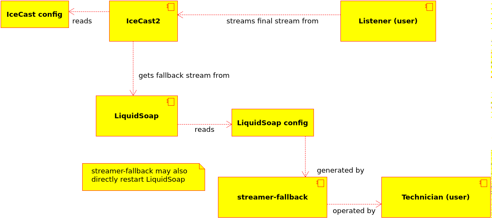

# streamer-fallback

Programvare for å styre hva som går på streamen når direktestreamen fra Lucas svikter

## Krav

* Lytterne får noe annet enn stillhet når streamer går ned
* Lytterne merker ikke at streamer går ned (annet enn at de muligens må koble til på nytt)
* Flere dagers nedetid skal støttes, når vi gir beskjed til systemet i forveien
* Brukervennlig interface kan brukes av hvem som helst i teknisk
* Ikke tap av kvalitet når streamer er oppe
* Uatoriserte skal ikke kunne ødelegge for oss eller lytterne

## Hvordan henger ting sammen?

IceCast2 konfigueres av vi som setter den opp, og kjører etter det uten endringer i konfigurasjonen.

LiquidSoap gir IceCast2 en fallback-stream som IceCast bruker når streamen den relayer ikke lenger
er oppe. Én LiquidSoap-instans kjører om gangen, men hvilket skript den bruker varierer ut i fra
hva vi ønsker at skal gå på streamen når den er nede.

LiquidSoap-skriptet genereres nemlig av streamer-fallback ved behov. Hvis vi bytter fra tekniske problemer
til nattmusikk, vil et nytt skript genereres, den gamle LiquidSoap-instansen termineres og en ny
LiquidSoap-instans startes med utgangspunkt i det nye skriptet. Hvis vi kjører repriser fra streamer-fallback,
så vil et nytt skript genereres daglig for å matche ny sendeplan per dag.

## Utvikling

README skrives på norsk, brukergrensesnitt skrives på norsk, ellers skrives alt på engelsk, inkludert UML-diagrammene.

Hvis du gjør endringer i UML-diagrammene, MÅ du eksportere nye versjoner av disse i samme commit. Det tillates ikke
eksporterte diagrammer ikke matcher originalen.

Det er [Umbrello](https://umbrello.kde.org/) som brukes som UML-diagram-verktøy. Ved eksport trenger du bare å velge «Export as images…» og
eksportere alle diagrammer inn i `uml`-mappa. Du skal bruke 150 som DPI og huke av «Use folders».

## Detaljerte krav

### CLI

* Samle opplysninger fra brukeren
  * Hvor mange dager?
  * Ser dette riktig ut?
  * Nok plass?
  * Er disse sendingene livesendinger?
  * Er «Nattmusikk» nattmusikk?
* Bekrefte at endringer er gjort
* Skrive ut tilbakemelding på hvor langt eventuelle langvarige prosesser har kommet

### Core

* Laste ned sendeplan for oppgitte dager
* Endre konfigurasjonen til LiquidSoap, gitt innstillinger fra Icecast2, sendeplan og start- og sluttdatoer.
* Sjekke syntaksen til genererte filer, så ikke LiquidSoap går ned pga. det
* Restarte LiquidSoap ved behov (endring i konfigurasjonen), men kun hvis ønskelig (skal også kunne planlegge omstart)
* Tilgangskontroll (må kjøres med sudo)
* Gi output på en måte som enkelt kan tolkes via programmering, f. eks. CLI. Dette gjelder også tilbakemelding
  underveis om hvor langt f. eks. en nedlasting har kommet

